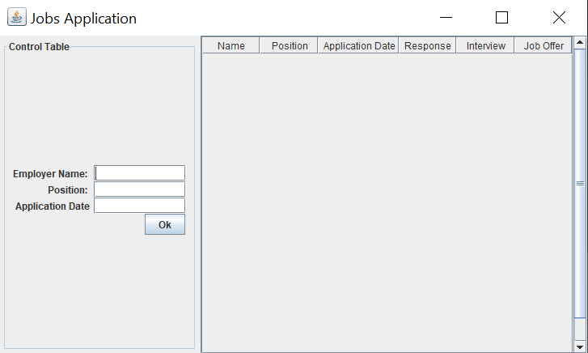
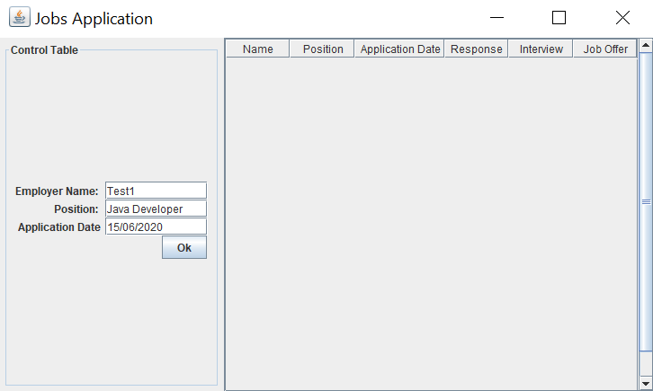
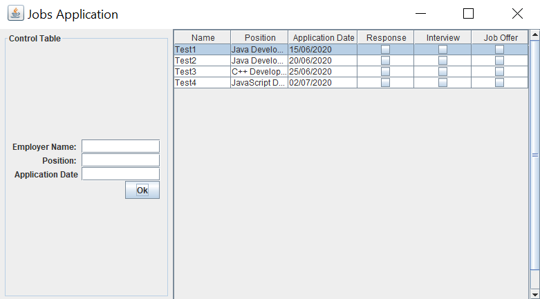
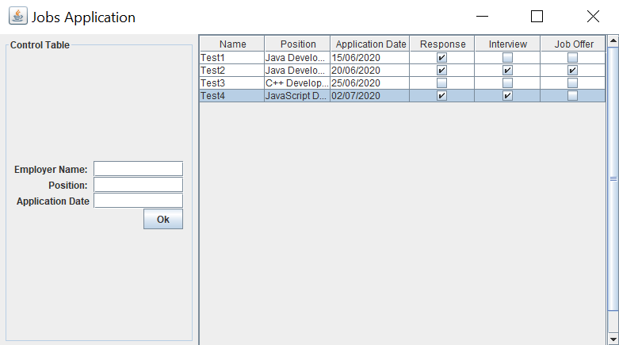
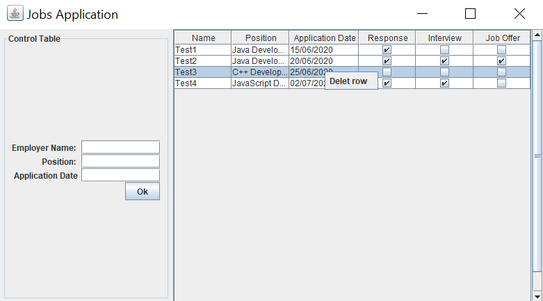
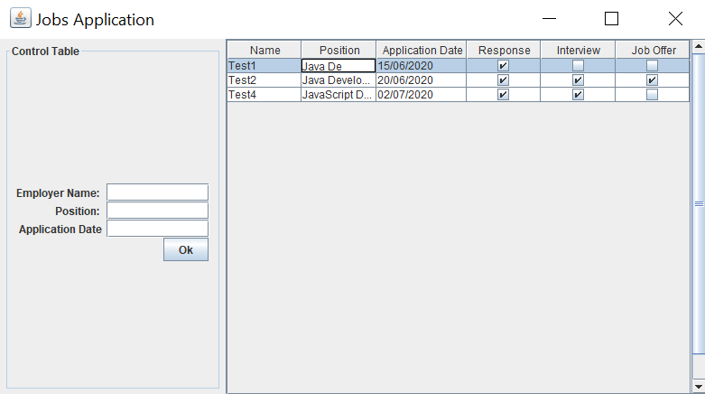

# Jobs Application Follower

It is a simple application. I made it to follow the jobs where to I applied.

 

The user can set the name of the employer, the position where he/she appleid, and the date of application.

 

Then later on can the user check what was the response of the employer. 

 
 

The records can be deleted with right click on the row and then "Delete row".

 

The records can be edited also, double click on the row and column where the user want to edit and then when it is changed push Enter.
 
 

### Built with 
Java;
Swing;
JDBC;
Derby;
